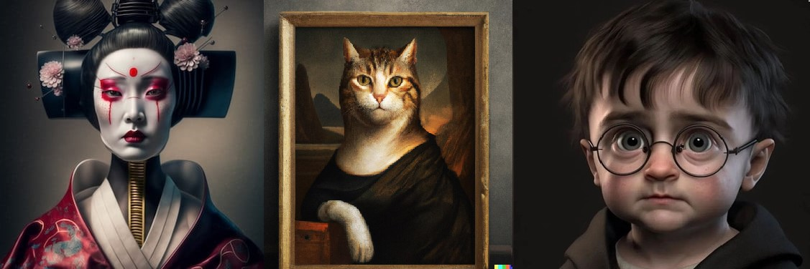

# AI Image Classifier

AI Image Classifier is a machine learning model that can effectively classify Real and AI Generated Images.

# Table of Contents

- [AI Image Classifier](#ai-image-classifier)
- [Table of Contents](#table-of-contents)
- [Brief Overview](#brief-overview)
- [Demo](#demo)
- [Installation](#installation)
- [Data Sources](#data-sources)
- [Model](#model)
- [Testing and Evaluation](#testing-and-evaluation)
- [Deployment](#deployment)

# Brief Overview
[(Back to top)](#table-of-contents)

This project involved building a machine learning model that can classify real and AI generated images. The first step was to create a dataset comprising of AI-generated and real images. To accomplish this, `pygoogle_image` was used, with which images from Google were downloaded. Apart from Google Images, two more datasets were used.

- CIFAKE: Real and AI-Generated Synthetic Images 
- Ai Generated Images | Images Created using Ai from Kaggle

These images were preprocessed and features were extracted. Then, a Convolutional Nueral Network based Classifier model was constructed and trained on the dataset containing around 1,00,000 images.

# Demo
[(Back to top)](#table-of-contents)

Here is a short demo of the deployed web application.

https://github.com/SanKolisetty/AI-Image-Classifier/assets/95172001/0ebe3ffb-4afe-4a7b-96d3-80ce5e7ce99f

# Installation
[(Back to top)](#table-of-contents)

Open Git Bash and change the directory to the location where the repository is to be cloned. Then, type the following commands.

```shell
  git init
```
```shell
  git clone https://github.com/SanKolisetty/AI-Image-Classifier.git
```
Now, install the requirements using the following command.

```shell
   pip install -r requirements.txt 
```
To access or use the application, open a terminal in the cloned repository folder and run the following command.

```shell
  streamlit run deploy.py
```
Finally, browse the link provided in your browser.

# Data Sources
[(Back to top)](#table-of-contents)

The dataset comprised of Real and AI Generated Images. Images were collected from Google using the python library `pygoogle_image`. Every single image was verified to avoid issues such as incorrect and ambigous images. Two other datsets were also used.

- CIFAKE: Real and AI-Generated Synthetic Images ( [Link](https://www.kaggle.com/datasets/birdy654/cifake-real-and-ai-generated-synthetic-images) )
- Ai Generated Images | Images Created using AI ( [Link](https://www.kaggle.com/datasets/anasmahmood000/ai-generated-images) )

Combing the three datasets, we have:

- Train Set: 101031
- Test Set: 20000

# Model
[(Back to top)](#table-of-contents)

The CNN model was built similar to `VGG16` and was trained on the train dataset. The model has a `Convolutional` Layer, `MaxPooling` Layer and a `Dropout` Layer repeated four times with increasing sizes of filters of the Convolutional Layer i.e. 32, 64, 128, and 256. It has 3 dense layers. The activation for all the layers is `relu` except for the last layer, which has activation `sigmoid`. 

> The model architecture and model summary are uploaded.

# Testing and Evaluation
[(Back to top)](#table-of-contents)

On evaluation, model achieved an accuracy of 93.90% 

Classification Report:


Confusion Matrix:


> 0 is Real and 1 is AI Generated

# Deployment
[(Back to top)](#table-of-contents)

The application has been deployed in the Streamlit Cloud.

You can access it here: [https://ai-image-classifier-sk.streamlit.app/](https://ai-image-classifier-sk.streamlit.app/)
